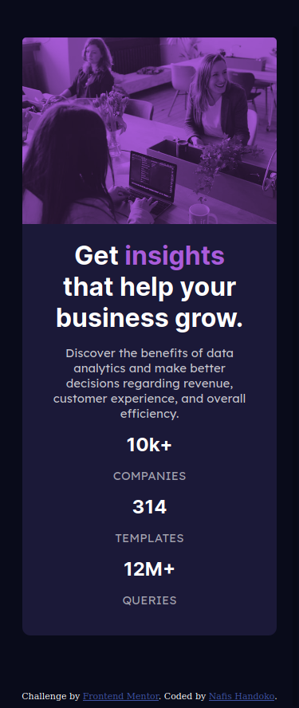

# Frontend Mentor - Stats preview card component solution

This is a solution to the [Stats preview card component challenge on Frontend Mentor](https://www.frontendmentor.io/challenges/stats-preview-card-component-8JqbgoU62). Frontend Mentor challenges help you improve your coding skills by building realistic projects. 

## Table of contents

- [Overview](#overview)
  - [The challenge](#the-challenge)
  - [Screenshot](#screenshot)
  - [Links](#links)
- [My process](#my-process)
  - [Built with](#built-with)
  - [Useful resources](#useful-resources)
- [Author](#author)

## Overview

### The challenge

Users should be able to:

- View the optimal layout depending on their device's screen size

### Screenshot

### Links

- Solution URL: [Add solution URL here](https://your-solution-url.com)
- Live Site URL: [Add live site URL here](https://your-live-site-url.com)

## My process

### Built with

- Semantic HTML5 markup
- CSS custom properties
- Flexbox
- Mobile-first workflow

### Useful resources

- [CSS Selectors Reference](https://www.w3schools.com/cssref/css_selectors.asp) - This article helped me to understand CSS Selectors.
- [A Complete Guide to CSS Media Queries | CSS-Tricks](https://css-tricks.com/a-complete-guide-to-css-media-queries/) - This is an amazing article which helped me understand Media Queries.
- [A Complete Guide to Flexbox | CSS-Tricks](https://css-tricks.com/snippets/css/a-guide-to-flexbox/) - This resource has a great explanation of using flexbox and i will use it going forward.

## Author

- Website - [Nafis Handoko](https://nafishandoko.github.io)
- Frontend Mentor - [@nafishandoko](https://www.frontendmentor.io/profile/nafishandoko)
- Instagram - [@nafishandoko](https://www.instagram.com/nafishandoko/)

